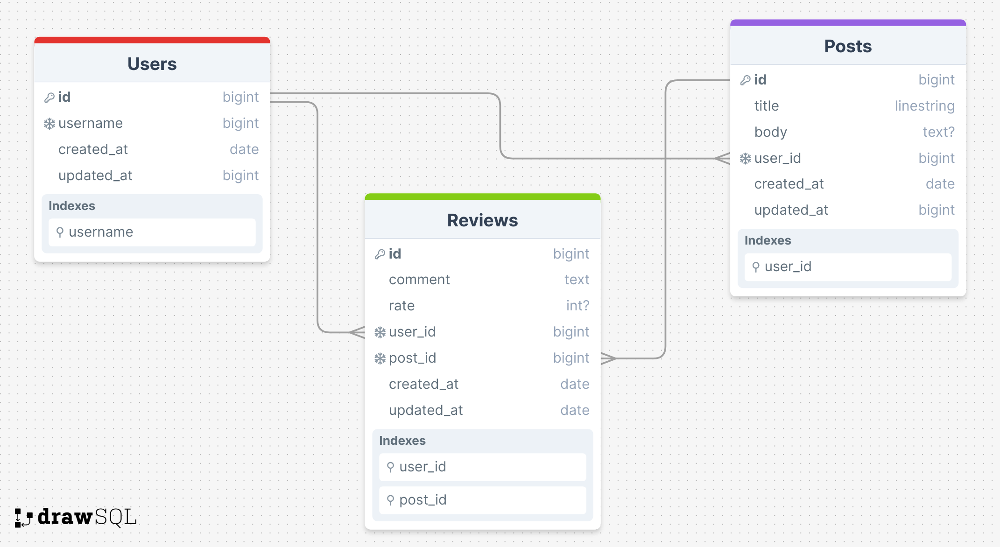

# Inova Task

Welcome to the Inova Task API! This API is dockerized for easy setup and testing. Follow the steps below to get started.

## Getting Started

### Prerequisites

- Docker must be installed on your machine.

### Setup

1. Clone this repository to your local machine:

   ```bash
   git clone <repository_url>
  ```
2. Navigate to the project directory:

  ```bash
    cd project-name
  ```
3. Start the Docker containers:

  ```bash
    docker compose up --build
  ```

This command will start the following:
- The app container, which hosts the Puma server for the API.
- The database container, running the necessary database for the API.
- It will install all Docker images, dependencies, and gems required by the project.

4. Once the containers are up and running, Docker will automatically run the following:
- `rake db:prepare`: This will create all databases (`development` and `test`), load all schemas, and initialize with seed data if the database does not exist. If the database already exists, it will run any pending migrations.
The Puma server will be accessible on port `3000` by default.

## Usage
- After the setup is complete, you can access the API playground at http://localhost:3000.

## API Documentation
- All API endpoints are documented using Swagger API Documentation. You can access the Swagger UI to explore and test the endpoints interactively by visiting [Swagger API Documentation](http://localhost:3000/api-docs/swagger.json).

## ERD

